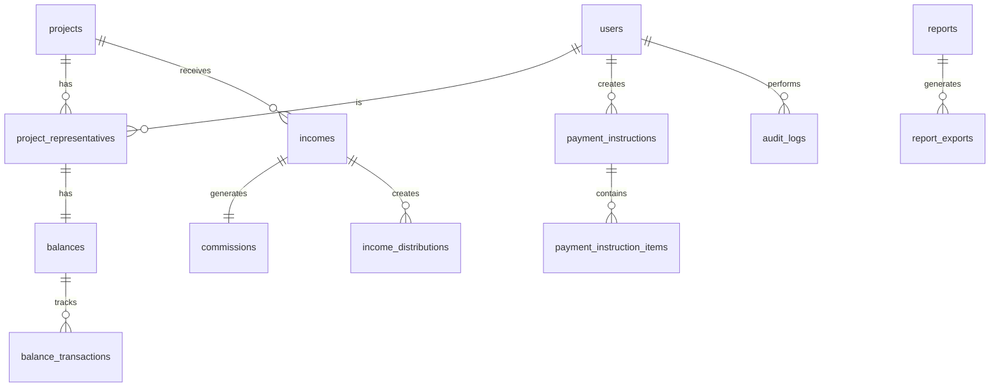

# Data Model: Akademik Proje Gelir Dağıtım Sistemi

## Entity Relationship Diagram



## Entity Definitions

### 1. users
Primary entity for system authentication and authorization.

| Field | Type | Constraints | Description |
|-------|------|------------|-------------|
| id | UUID | PK, NOT NULL | Supabase Auth UUID |
| email | VARCHAR(255) | UNIQUE, NOT NULL | Login email |
| full_name | VARCHAR(255) | NOT NULL | Display name |
| role | ENUM | NOT NULL | admin, finance_officer, academician |
| phone | VARCHAR(20) | NULL | Contact number |
| iban | VARCHAR(34) | NULL | Bank account for payments |
| created_at | TIMESTAMP | NOT NULL | Registration date |
| updated_at | TIMESTAMP | NOT NULL | Last modification |
| is_active | BOOLEAN | DEFAULT true | Account status |

### 2. projects
Academic projects that receive income.

| Field | Type | Constraints | Description |
|-------|------|------------|-------------|
| id | UUID | PK, DEFAULT uuid_generate_v4() | Unique identifier |
| code | VARCHAR(20) | UNIQUE, NOT NULL | Auto-generated PRJ-2025-001 |
| name | VARCHAR(255) | NOT NULL | Project title |
| budget | DECIMAL(15,2) | NOT NULL, CHECK > 0 | Total budget |
| start_date | DATE | NOT NULL | Project start |
| end_date | DATE | NULL | Project end |
| status | ENUM | DEFAULT 'active' | active, completed, cancelled |
| created_at | TIMESTAMP | NOT NULL | Creation date |
| created_by | UUID | FK users.id | Creator user |

### 3. project_representatives
Links academicians to projects with share percentages.

| Field | Type | Constraints | Description |
|-------|------|------------|-------------|
| id | UUID | PK, DEFAULT uuid_generate_v4() | Unique identifier |
| project_id | UUID | FK projects.id, NOT NULL | Associated project |
| user_id | UUID | FK users.id, NOT NULL | Academician user |
| share_percentage | DECIMAL(5,2) | NOT NULL, CHECK 0-100 | Revenue share % |
| is_lead | BOOLEAN | DEFAULT false | Project lead flag |
| created_at | TIMESTAMP | NOT NULL | Assignment date |
| UNIQUE | project_id, user_id | | One entry per user per project |

### 4. incomes
Revenue entries for projects.

| Field | Type | Constraints | Description |
|-------|------|------------|-------------|
| id | UUID | PK, DEFAULT uuid_generate_v4() | Unique identifier |
| project_id | UUID | FK projects.id, NOT NULL | Associated project |
| gross_amount | DECIMAL(15,2) | NOT NULL, CHECK > 0 | Total with VAT |
| vat_rate | DECIMAL(5,2) | DEFAULT 18.00 | VAT percentage |
| vat_amount | DECIMAL(15,2) | NOT NULL | Calculated VAT |
| net_amount | DECIMAL(15,2) | NOT NULL | Gross - VAT |
| description | TEXT | NULL | Income details |
| income_date | DATE | NOT NULL | Receipt date |
| created_at | TIMESTAMP | NOT NULL | Entry date |
| created_by | UUID | FK users.id | Entry user |

### 5. commissions
Company commission from each income.

| Field | Type | Constraints | Description |
|-------|------|------------|-------------|
| id | UUID | PK, DEFAULT uuid_generate_v4() | Unique identifier |
| income_id | UUID | FK incomes.id, UNIQUE | Related income |
| rate | DECIMAL(5,2) | DEFAULT 15.00 | Commission % |
| amount | DECIMAL(15,2) | NOT NULL | Commission amount |
| created_at | TIMESTAMP | NOT NULL | Calculation date |

### 6. income_distributions
Distribution of income to representatives after commission.

| Field | Type | Constraints | Description |
|-------|------|------------|-------------|
| id | UUID | PK, DEFAULT uuid_generate_v4() | Unique identifier |
| income_id | UUID | FK incomes.id, NOT NULL | Source income |
| user_id | UUID | FK users.id, NOT NULL | Recipient |
| share_percentage | DECIMAL(5,2) | NOT NULL | Share at time |
| amount | DECIMAL(15,2) | NOT NULL | Calculated amount |
| created_at | TIMESTAMP | NOT NULL | Distribution date |

### 7. balances
Current balance for each academician.

| Field | Type | Constraints | Description |
|-------|------|------------|-------------|
| id | UUID | PK, DEFAULT uuid_generate_v4() | Unique identifier |
| user_id | UUID | FK users.id, UNIQUE | Academician |
| available_amount | DECIMAL(15,2) | DEFAULT 0.00 | Available funds |
| debt_amount | DECIMAL(15,2) | DEFAULT 0.00 | Outstanding debt |
| reserved_amount | DECIMAL(15,2) | DEFAULT 0.00 | Pending payments |
| last_updated | TIMESTAMP | NOT NULL | Last change |

### 8. balance_transactions
Transaction history for balance changes.

| Field | Type | Constraints | Description |
|-------|------|------------|-------------|
| id | UUID | PK, DEFAULT uuid_generate_v4() | Unique identifier |
| balance_id | UUID | FK balances.id, NOT NULL | Related balance |
| type | ENUM | NOT NULL | income, payment, debt, adjustment |
| amount | DECIMAL(15,2) | NOT NULL | Transaction amount |
| balance_before | DECIMAL(15,2) | NOT NULL | Previous balance |
| balance_after | DECIMAL(15,2) | NOT NULL | New balance |
| reference_type | VARCHAR(50) | NULL | Source type |
| reference_id | UUID | NULL | Source ID |
| description | TEXT | NULL | Transaction details |
| created_at | TIMESTAMP | NOT NULL | Transaction date |

### 9. payment_instructions
Payment orders for academicians.

| Field | Type | Constraints | Description |
|-------|------|------------|-------------|
| id | UUID | PK, DEFAULT uuid_generate_v4() | Unique identifier |
| instruction_number | VARCHAR(20) | UNIQUE | PAY-2025-001 |
| user_id | UUID | FK users.id, NOT NULL | Recipient |
| total_amount | DECIMAL(15,2) | NOT NULL | Payment amount |
| status | ENUM | DEFAULT 'pending' | pending, approved, processing, completed, rejected |
| bank_export_file | TEXT | NULL | CSV/XML path |
| approved_by | UUID | FK users.id, NULL | Approver |
| approved_at | TIMESTAMP | NULL | Approval date |
| processed_at | TIMESTAMP | NULL | Bank process date |
| notes | TEXT | NULL | Instructions |
| created_at | TIMESTAMP | NOT NULL | Creation date |
| created_by | UUID | FK users.id | Creator |

### 10. payment_instruction_items
Line items in payment instructions.

| Field | Type | Constraints | Description |
|-------|------|------------|-------------|
| id | UUID | PK, DEFAULT uuid_generate_v4() | Unique identifier |
| instruction_id | UUID | FK payment_instructions.id | Parent instruction |
| income_distribution_id | UUID | FK income_distributions.id | Source distribution |
| amount | DECIMAL(15,2) | NOT NULL | Item amount |
| description | TEXT | NULL | Item details |

### 11. reports
Generated reports metadata.

| Field | Type | Constraints | Description |
|-------|------|------------|-------------|
| id | UUID | PK, DEFAULT uuid_generate_v4() | Unique identifier |
| type | ENUM | NOT NULL | project, academician, company, payments |
| parameters | JSONB | NOT NULL | Report filters |
| generated_by | UUID | FK users.id | Generator |
| generated_at | TIMESTAMP | NOT NULL | Generation date |

### 12. report_exports
Export files for reports.

| Field | Type | Constraints | Description |
|-------|------|------------|-------------|
| id | UUID | PK, DEFAULT uuid_generate_v4() | Unique identifier |
| report_id | UUID | FK reports.id | Parent report |
| format | ENUM | NOT NULL | excel, pdf |
| file_path | TEXT | NOT NULL | Storage path |
| file_size | INTEGER | NOT NULL | Bytes |
| created_at | TIMESTAMP | NOT NULL | Export date |

### 13. audit_logs
System audit trail.

| Field | Type | Constraints | Description |
|-------|------|------------|-------------|
| id | UUID | PK, DEFAULT uuid_generate_v4() | Unique identifier |
| user_id | UUID | FK users.id | Actor |
| action | VARCHAR(100) | NOT NULL | Action type |
| entity_type | VARCHAR(50) | NOT NULL | Target entity |
| entity_id | UUID | NULL | Target ID |
| old_values | JSONB | NULL | Previous state |
| new_values | JSONB | NULL | New state |
| ip_address | INET | NULL | Client IP |
| user_agent | TEXT | NULL | Browser info |
| created_at | TIMESTAMP | NOT NULL | Action time |

## Business Rules & Constraints

### Database-Level Constraints

1. **Project Representatives Total Share**
   ```sql
   CREATE FUNCTION check_total_shares() RETURNS TRIGGER AS $$
   BEGIN
     IF (SELECT SUM(share_percentage) FROM project_representatives
         WHERE project_id = NEW.project_id) != 100 THEN
       RAISE EXCEPTION 'Total share percentages must equal 100%';
     END IF;
     RETURN NEW;
   END;
   $$ LANGUAGE plpgsql;
   ```

2. **Balance Non-Negative with Debt**
   ```sql
   ALTER TABLE balances
   ADD CONSTRAINT positive_amounts
   CHECK (available_amount >= 0 AND debt_amount >= 0);
   ```

3. **Income Calculation Validation**
   ```sql
   ALTER TABLE incomes
   ADD CONSTRAINT vat_calculation
   CHECK (vat_amount = ROUND(gross_amount * vat_rate / (100 + vat_rate), 2));
   ```

4. **Payment Instruction Amount Check**
   ```sql
   CREATE FUNCTION check_payment_amount() RETURNS TRIGGER AS $$
   BEGIN
     IF NEW.total_amount > (
       SELECT available_amount FROM balances
       WHERE user_id = NEW.user_id
     ) THEN
       RAISE EXCEPTION 'Insufficient balance for payment';
     END IF;
     RETURN NEW;
   END;
   $$ LANGUAGE plpgsql;
   ```

### Application-Level Rules

1. **Automatic Project Code Generation**
   - Format: PRJ-YYYY-NNN (e.g., PRJ-2025-001)
   - Sequential numbering per year
   - Unique across system

2. **VAT and Commission Calculation**
   - VAT extracted from gross: `vat = gross * vat_rate / (100 + vat_rate)`
   - Net amount: `net = gross - vat`
   - Commission: `commission = net * 0.15`
   - Distributable: `distributable = net - commission`

3. **Debt Management**
   - New income first applies to debt reduction
   - Remaining amount added to available balance
   - Payment blocked if debt exists

4. **Role-Based Operations**
   - Admin: Full CRUD on all entities
   - Finance Officer: Create/update incomes, payments, view all
   - Academician: View own projects, balances, reports only

5. **Audit Requirements**
   - All financial transactions logged
   - Balance changes tracked with before/after
   - User actions recorded with timestamp

## Indexes for Performance

```sql
-- Frequent lookups
CREATE INDEX idx_projects_code ON projects(code);
CREATE INDEX idx_projects_status ON projects(status);
CREATE INDEX idx_project_reps_user ON project_representatives(user_id);
CREATE INDEX idx_project_reps_project ON project_representatives(project_id);
CREATE INDEX idx_incomes_project ON incomes(project_id);
CREATE INDEX idx_incomes_date ON incomes(income_date);
CREATE INDEX idx_balances_user ON balances(user_id);
CREATE INDEX idx_balance_trans_balance ON balance_transactions(balance_id);
CREATE INDEX idx_payment_inst_user ON payment_instructions(user_id);
CREATE INDEX idx_payment_inst_status ON payment_instructions(status);

-- Composite indexes for complex queries
CREATE INDEX idx_income_project_date ON incomes(project_id, income_date);
CREATE INDEX idx_audit_user_date ON audit_logs(user_id, created_at);
```

## Migration Order

1. Enable UUID extension
2. Create users table
3. Create projects table
4. Create project_representatives table with trigger
5. Create balances table
6. Create incomes table
7. Create commissions table
8. Create income_distributions table
9. Create balance_transactions table
10. Create payment_instructions table
11. Create payment_instruction_items table
12. Create reports table
13. Create report_exports table
14. Create audit_logs table
15. Create all indexes
16. Set up Row Level Security policies